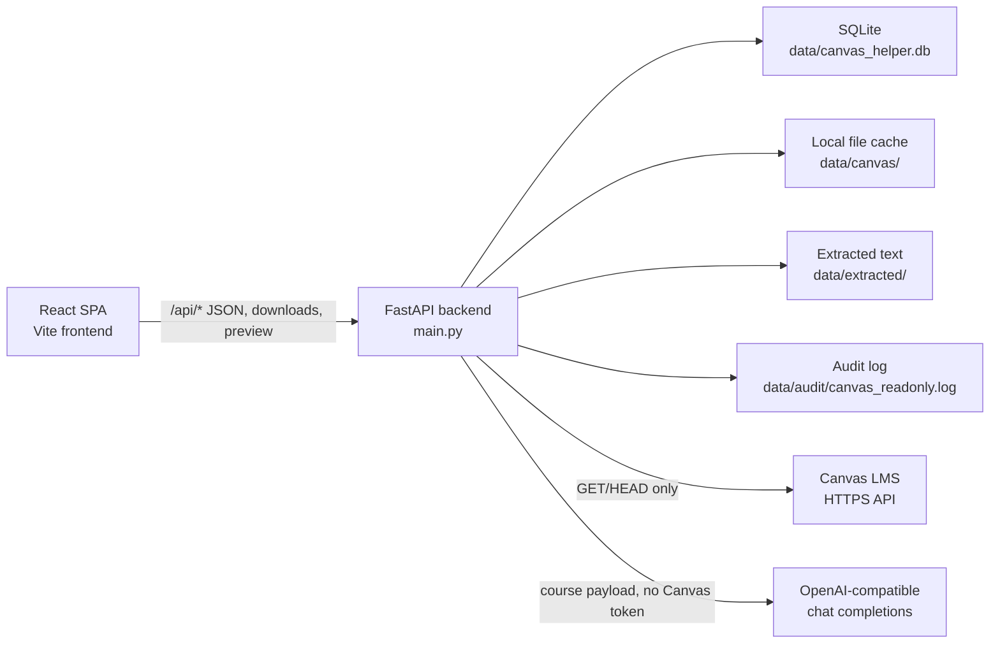
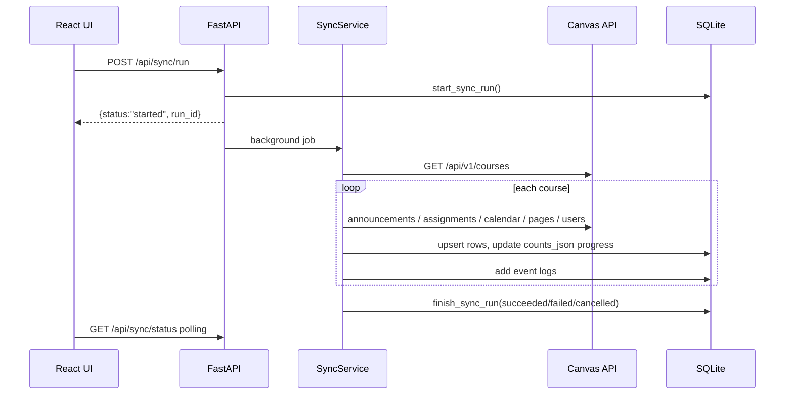
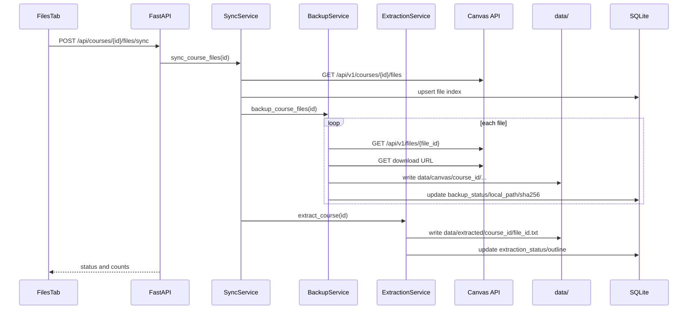
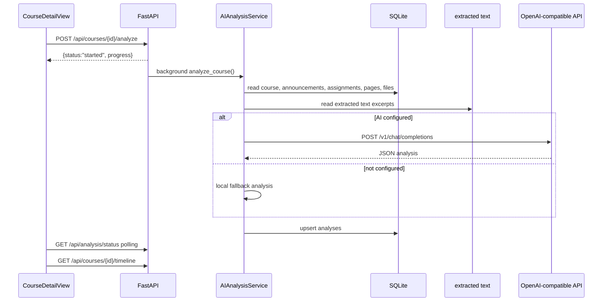

# Canvas_helper 技术文档

本文档面向后续开发、维护、测试和交接，说明本项目的系统架构、核心功能、模块职责、数据模型、接口契约、安全边界与扩展点。

## 1. 项目概述

Canvas_helper 是一个私有 Canvas 课程资料管理工具。系统通过后端只读 Canvas API 客户端同步课程、公告、作业、日历、页面、成员与文件索引，将数据落入本地 SQLite 缓存；需要时再按课程或选中文件下载课件到本地 `data/` 目录，并对 PDF、PPTX、DOCX、HTML、文本、ZIP 等文件做文本抽取和 OCR 辅助分析。前端提供课程仪表盘、课程详情、资料库、时间线、配置和运行日志视图。

系统的主要目标是：

- 将 Canvas 访问凭据隔离在服务端，浏览器永不接触 Canvas API Token。
- 用本地 SQLite 缓存承载课程元数据，降低 Canvas API 访问频率。
- 支持按需下载和预览课程文件，并保留历史版本。
- 基于同步后的结构化数据和已抽取文本生成课程分析、时间线和课程大纲。
- 通过审计日志和事件日志保留同步、下载、抽取、AI 分析过程。

## 2. 技术栈

| 层级 | 技术 |
| --- | --- |
| 后端 Web 框架 | FastAPI |
| 后端异步 HTTP | httpx |
| 配置管理 | pydantic-settings + `.env` |
| 本地数据库 | SQLite |
| 文件抽取 | PyMuPDF、python-pptx、python-docx、BeautifulSoup、Pillow、pytesseract |
| AI 调用 | OpenAI-compatible `/v1/chat/completions` 接口 |
| 前端框架 | React 19 + TypeScript |
| 构建工具 | Vite |
| 样式 | Tailwind CSS + 自定义 CSS |
| 图标 | lucide-react |
| 测试 | pytest、pytest-asyncio、FastAPI TestClient、TypeScript build |

## 3. 目录结构

```text
Canvas_helper/
  backend/
    app/
      main.py                 # FastAPI 应用、生命周期、REST API、后台任务调度
      config.py               # 环境变量与运行配置
      db.py                   # SQLite schema、连接封装、settings/sync/event 操作
      canvas_client.py        # Canvas 只读安全客户端
      sync_service.py         # Canvas 元数据同步
      backup_service.py       # Canvas 文件下载、路径保留、版本归档
      extraction_service.py   # 文件文本抽取和 OCR
      ai/                     # AI 分析、Agent、工具调用与 skill 注册
        __init__.py           # AI 模块统一导出
        agent.py              # OpenAI-compatible Agent、bash/grep 工具、skill
        service.py            # 课程分析、AI 调用、本地 fallback
      ai_agent.py             # 兼容旧导入路径
      ai_service.py           # 兼容旧导入路径
      __main__.py             # 后端模块启动入口
  frontend/
    src/
      App.tsx                 # SPA 顶层状态、导航、轮询、全局动作
      api/                    # 前端 REST API 封装
      views/                  # Dashboard、CourseDetail、Settings 和课程 Tab
      components/             # UI、设置面板、进度条、Canvas home panel
      types/                  # 前后端共享响应类型定义
      utils/                  # 格式化、课程状态、进度解析、标签映射
      i18n/                   # 英文/中文 UI 文案
  tests/                      # 后端单元测试和 API smoke tests
  data/                       # 运行时数据：SQLite、文件缓存、抽取文本、审计日志
  requirements.txt            # Python 依赖
  package.json                # 根 npm 脚本和 concurrently
  start.ps1 / start.bat       # Windows 启动脚本
```

`data/`、`node_modules/`、`frontend/dist/`、`.venv/` 属于运行或构建产物，不应作为核心源码维护。

## 4. 总体架构



运行时分为四条主线：

1. 前端通过 `/api/*` 读取本地缓存、触发同步、下载或预览文件、保存配置。
2. 后端通过 `CanvasReadOnlyClient` 访问 Canvas，只允许 `GET` 和 `HEAD`，并限制 host 与路径。
3. 同步服务将 Canvas 元数据写入 SQLite；文件下载服务将课件写入 `data/canvas/course_<id>/...`。
4. 抽取服务生成 `data/extracted/course_<id>/<file_id>.txt`，AI 服务读取这些缓存并保存课程分析。

## 5. 后端启动与应用状态

后端入口是 `backend.app.main:app`。

FastAPI `lifespan` 启动流程：

1. 读取 `Settings`。
2. 创建 `data_dir`。
3. 初始化 Canvas 审计日志 logger。
4. 创建 `AppState`。
5. 初始化 SQLite schema。
6. 将上次服务异常退出遗留的 `running` 同步任务标为 `interrupted`。
7. 如果数据库中 `sync.enabled=true`，启动后台定时同步任务。

`AppState` 保存全局运行态：

| 字段 | 说明 |
| --- | --- |
| `settings` | 环境变量和默认配置 |
| `db` | SQLite 数据访问对象 |
| `sync_lock` | 全局/课程元数据同步互斥锁 |
| `file_sync_lock` | 文件同步互斥锁 |
| `analysis_lock` | AI 分析互斥锁 |
| `sync_cancel_event` | 用户中断同步时设置 |
| `scheduler_task` | 定时同步后台任务 |
| `analysis_progress` | AI 分析进度对象 |

## 6. 后端模块职责

### 6.1 `config.py`

`Settings` 通过 `.env` 和环境变量加载配置。

| 配置项 | 默认值 | 说明 |
| --- | --- | --- |
| `CANVAS_BASE_URL` | `https://canvas.example.edu/` | Canvas 实例地址，必须是 HTTPS |
| `CANVAS_API_TOKEN` | 空 | Canvas API Token，可由数据库设置覆盖 |
| `OPENAI_COMPAT_BASE_URL` | 空 | OpenAI-compatible 服务地址 |
| `OPENAI_COMPAT_API_KEY` | 空 | AI 服务密钥，可由数据库设置覆盖 |
| `OPENAI_COMPAT_MODEL` | `gpt-4.1-mini` | 默认模型名 |
| `DATA_DIR` | `./data` | 数据目录 |
| `SQLITE_PATH` | 空 | SQLite 路径；为空时使用 `DATA_DIR/canvas_helper.db` |
| `OCR_ENABLED` | `true` | 是否启用 OCR |
| `OCR_LANGUAGES` | `eng+chi_sim` | Tesseract 语言包 |
| `OCR_MAX_PAGES` | `20` | PDF OCR 最大页数 |
| `CANVAS_TIMEOUT_SECONDS` | `60.0` | Canvas API 超时 |
| `CANVAS_DOWNLOAD_TIMEOUT_SECONDS` | `180.0` | 下载超时配置，目前主下载客户端使用通用 Canvas timeout |

`canvas_base_url` 会被校验为 HTTPS 且必须包含 host，并统一补尾部 `/`。

### 6.2 `db.py`

`Database` 是 SQLite 的轻量封装，提供：

- `connect()`：上下文管理连接，启用 foreign key，自动 commit/close。
- `init()`：创建所有表和索引，并写入默认设置。
- `get_setting()` / `put_settings()`：读写运行配置。
- `start_sync_run()` / `finish_sync_run()` / `update_sync_run_counts()` / `latest_sync_run()`：同步任务状态管理。
- `mark_stale_sync_runs_interrupted()`：服务启动时修复遗留运行态。
- `add_event()` / `list_events()`：运行事件记录和查询。

事件日志最多保留最近 2000 条；查询接口最多返回 500 条。

### 6.3 `canvas_client.py`

`CanvasReadOnlyClient` 是项目最关键的安全边界。

安全规则：

- 只允许 `GET` 和 `HEAD`。
- 只允许访问配置的 Canvas host。
- 只允许路径以 `/api/v1/` 开头，或 Canvas 文件下载路径 `/files/.../download`。
- Canvas API 重定向到非 Canvas host 会被拒绝。
- Canvas 文件下载允许跳转到外部 HTTPS 存储地址，但不会向外部 host 发送 Authorization header。
- 禁止 HTTP、URL fragment、URL 中用户名/密码。
- 审计日志记录 method、path、status、bytes、error，不记录 query string，避免泄露 Canvas file verifier。

主要方法：

| 方法 | 说明 |
| --- | --- |
| `request(method, path_or_url, params=None)` | 发起安全校验后的 Canvas 请求 |
| `get_json(path_or_url, params=None)` | GET 并解析 JSON |
| `paginate(path_or_url, params=None, max_pages=50)` | 根据 Link header 拉取分页 |
| `download_to_file(url, destination, check_cancelled=None)` | 流式下载文件、计算 SHA-256、使用临时文件原子替换 |

### 6.4 `sync_service.py`

`SyncService` 负责同步 Canvas 元数据到 SQLite。

同步范围：

- courses
- announcements
- assignments
- calendar_events
- pages
- course_people
- files index

核心方法：

| 方法 | 说明 |
| --- | --- |
| `sync_all(run_id, course_id=None, sync_files=True, download_files=False)` | 同步所有或单个课程的元数据，可选同步文件索引和下载文件 |
| `sync_course_non_file(run_id, course_id)` | 只同步单个课程非文件元数据 |
| `sync_course_files(course_id)` | 同步文件索引、下载课程文件、抽取文本 |

增量策略：

- 每条 Canvas 原始 JSON 会被 `json.dumps(..., sort_keys=True)` canonicalize。
- 写入前与数据库 `raw_json` 比较。
- 未变化记为 `unchanged`，变化则 upsert 并记为 `updated`。

容错策略：

- announcements、assignments、calendar events、pages、people、files 的权限错误或不存在错误，如果 Canvas 返回 `401/403/404`，对应列表视为空列表。
- 整体同步支持用户中断，中断时 sync run 状态为 `cancelled`。
- 未捕获异常会将 sync run 标为 `failed` 并写入 event log。

### 6.5 `backup_service.py`

`BackupService` 负责按课程或选中文件下载课件。

关键行为：

- 下载前实时请求 `/api/v1/files/{file_id}` 获取最新 metadata 和 download URL。
- 不把 Canvas download URL 持久化到 `files.canvas_url`，避免保存 verifier 类敏感参数。
- 使用 Canvas 文件夹 `full_name` 还原本地目录结构，去掉首段 `course files`。
- 文件名和路径段使用 `safe_filename()` 过滤 Windows 非法字符。
- 如果本地文件已存在、大小匹配、路径匹配、`downloaded_canvas_updated_at == updated_at`，则跳过下载。
- 重新下载前会把旧文件移动到同目录 `.versions/`。
- 单个文件下载失败不会中断整个课程下载，会更新该文件 `backup_status='fail_download'`。

本地路径格式：

```text
data/canvas/course_<course_id>/<Canvas folder segments>/<display_name>
```

### 6.6 `extraction_service.py`

`ExtractionService` 负责把已下载文件转换为可被搜索、预览和 AI 分析消费的文本。

支持类型：

| 类型 | 处理方式 |
| --- | --- |
| PDF | PyMuPDF 提取文本；可对前 `OCR_MAX_PAGES` 页做 OCR |
| PPTX | python-pptx 提取 shape 文本；可对图片做 OCR |
| DOCX | python-docx 提取段落、表格；可对文档图片做 OCR |
| HTML/HTM | BeautifulSoup 提取纯文本 |
| TXT/MD/CSV/PY/JAVA/C/CPP/JS/TS | 直接读取 UTF-8 文本 |
| ZIP | 输出文件列表，状态为 `partial` |
| 其他 | 标记 `unsupported` |

输出：

```text
data/extracted/course_<course_id>/<file_id>.txt
```

抽取完成后会更新 `files.extraction_status`、`extraction_error`、`extracted_text_path`、`outline_json`、`extracted_at`。

`outline_json` 由 `_build_outline()` 从文本中启发式提取最多 20 条标题候选；如果没有候选，回退为文件名。

### 6.7 `ai/service.py` 与 `ai/agent.py`

`AIAnalysisService` 只读取本地 SQLite 和本地抽取文本，不持有 Canvas 客户端、Canvas token 或 Canvas API 权限。

流程：

1. 读取课程基本信息。
2. 读取最近 40 条公告。
3. 读取全部作业。
4. 读取最近 20 个 Canvas page。
5. 读取最近 80 个文件的 outline 和抽取文本片段。
6. 如果 AI base URL 和 API key 已配置，调用 OpenAI-compatible `/v1/chat/completions`。
7. 如果未配置或模型返回非 JSON，使用本地 fallback 或 fallback 解析。
8. 保存到 `analyses(course_id, kind='course_overview')`。

AI prompt 要求返回 JSON，字段包括：

- `summary`
- `timeline`
- `course_outline`
- `risks`
- `confidence_notes`

本地 fallback 会基于作业日期、公告关键词和文件 outline 生成简单分析。

## 7. 数据模型

数据库默认路径为：

```text
data/canvas_helper.db
```

### 7.1 表结构概览

| 表 | 主键 | 说明 |
| --- | --- | --- |
| `settings` | `key` | 运行配置，覆盖部分 `.env` 配置 |
| `courses` | `id` | Canvas 课程基础信息 |
| `announcements` | `id` | 课程公告 |
| `assignments` | `id` | 课程作业 |
| `calendar_events` | `id` | Canvas 日历事件 |
| `pages` | `(course_id, page_url)` | Canvas 页面，包含 front page/home page |
| `course_people` | `(course_id, user_id)` | 课程成员 |
| `files` | `id` | 文件索引、下载状态、抽取状态 |
| `analyses` | `(course_id, kind)` | AI 分析结果 |
| `sync_runs` | `id` | 同步任务状态和进度 |
| `event_logs` | `id` | 操作事件日志 |

### 7.2 核心字段说明

`files` 是最复杂的表：

| 字段 | 说明 |
| --- | --- |
| `id` | Canvas file id |
| `course_id` | 所属课程 |
| `display_name` / `filename` | 展示名和原文件名 |
| `content_type` / `size` / `updated_at` | Canvas 文件元数据 |
| `canvas_url` | 当前实现不持久化下载 URL，通常为 NULL |
| `local_path` | 本地下载文件路径 |
| `sha256` | 本地文件 SHA-256 |
| `backup_status` | `pending`、`downloading`、`downloaded`、`fail_download` 等 |
| `backup_error` | 下载错误信息 |
| `downloaded_at` | 本地下载完成时间 |
| `downloaded_canvas_updated_at` | 下载时 Canvas 文件更新时间 |
| `extraction_status` | `pending`、`extracted`、`partial`、`unsupported`、`error` |
| `extraction_error` | 抽取警告或错误 |
| `extracted_text_path` | 抽取文本路径 |
| `outline_json` | 启发式大纲 |
| `raw_json` | 脱敏后的 Canvas 原始 JSON |

`sync_runs.counts_json` 保存同步计数和进度：

```json
{
  "courses": 1,
  "announcements": 10,
  "assignments": 8,
  "files": 20,
  "updated": 3,
  "unchanged": 36,
  "progress": {
    "percent": 65,
    "stage": "Synced people and file index",
    "current": 1,
    "total": 5,
    "course": "CS101",
    "phase": "metadata",
    "status": "running"
  }
}
```

## 8. 后端 REST API

所有接口由 FastAPI 暴露在同源 `/api` 下。开发模式下前端 Vite dev server 访问后端 `127.0.0.1:8000` 时，后端允许 `http://localhost:5173` 和 `http://127.0.0.1:5173` CORS。

### 8.1 健康检查

#### `GET /api/health`

返回服务状态、Canvas base URL、token 是否配置、最近同步任务。

响应示例：

```json
{
  "ok": true,
  "canvas_base_url": "https://canvas.example.edu/",
  "token_configured": true,
  "latest_sync": {
    "id": 1,
    "status": "succeeded"
  }
}
```

### 8.2 课程与课程详情

#### `GET /api/courses`

返回课程列表，包含统计字段。

主要响应字段：

| 字段 | 类型 | 说明 |
| --- | --- | --- |
| `id` | number | Canvas course id |
| `name` | string | 课程名 |
| `course_code` | string/null | 课程代码 |
| `term_name` | string/null | 学期 |
| `workflow_state` | string/null | Canvas 状态 |
| `synced_at` | string | 最近同步时间 |
| `announcement_count` | number | 公告数量 |
| `assignment_count` | number | 作业数量 |
| `file_count` | number | 文件索引数量 |
| `downloaded_count` | number | 本地已下载文件数量 |

#### `GET /api/courses/{course_id}/announcements`

返回指定课程公告，按 `posted_at DESC` 排序。

#### `GET /api/courses/{course_id}/assignments`

返回指定课程作业，按 due/unlock/lock 时间和名称排序。

#### `GET /api/courses/{course_id}/people`

返回课程成员，教师/Instructor、TA 优先排序。

#### `GET /api/courses/{course_id}/home`

返回课程 Canvas home/front page。选择策略：

1. `raw_json.front_page == true`
2. `page_url` 为 `front-page`、`home`、`index`
3. title 包含 `home` 或 `front page`
4. 其他页面中最新的页面

无页面时返回 `null`。

#### `GET /api/courses/{course_id}/timeline`

合并结构化时间线和 AI 分析。

响应结构：

```json
{
  "structured": [
    {
      "title": "Lab 1",
      "date": "2026-05-28T00:00:00+00:00",
      "source": "assignment"
    }
  ],
  "analysis": {
    "summary": "...",
    "timeline": [],
    "course_outline": []
  },
  "data_sources": {
    "assignments": { "count": 1 },
    "calendar_events": { "count": 1 },
    "announcements": { "count": 1 },
    "ai_analysis": { "available": true }
  }
}
```

### 8.3 文件接口

#### `GET /api/courses/{course_id}/files`

返回课程文件列表，并把 `outline_json` 解析为 `outline` 数组。

主要状态：

| 状态字段 | 常见值 | 说明 |
| --- | --- | --- |
| `backup_status` | `pending` / `downloading` / `downloaded` / `fail_download` | 文件本地备份状态 |
| `extraction_status` | `pending` / `extracted` / `partial` / `unsupported` / `error` | 文本抽取状态 |

#### `GET /api/courses/{course_id}/files/{file_id}/download`

下载单个已缓存文件。

错误：

| 状态码 | 原因 |
| --- | --- |
| 404 | 文件未同步，或本地缓存文件不存在 |
| 409 | 文件未下载到本地缓存 |
| 500 | 本地路径不在配置的 `data_dir` 内 |

#### `POST /api/courses/{course_id}/files/download`

批量打包下载已缓存文件。

请求体：

```json
{
  "file_ids": [601, 602]
}
```

行为：

- 只加入已下载且本地存在的文件。
- 自动避免 zip 内重复文件名。
- 如果没有任何文件可加入，返回 `409`。

#### `GET /api/courses/{course_id}/files/{file_id}/preview`

浏览器内预览文件。

预览策略：

- 图片和 PDF：直接 inline `FileResponse`。
- 文本类或代码类：返回 HTML 包裹的文本预览。
- 其他类型：如果有抽取文本，则预览抽取文本。
- 无法预览：返回提示 HTML。

#### `POST /api/courses/{course_id}/files/{file_id}/extract`

对单个已缓存文件执行文本抽取。

响应：

```json
{
  "status": "completed",
  "counts": {
    "extracted": 1,
    "partial": 0,
    "skipped": 0,
    "failed": 0
  }
}
```

#### `POST /api/courses/{course_id}/files/{file_id}/backup`

下载单个文件并抽取文本。内部复用批量备份接口。

#### `POST /api/courses/{course_id}/files/backup`

下载选中文件并抽取文本。

请求体：

```json
{
  "file_ids": [601, 602]
}
```

响应：

```json
{
  "status": "completed",
  "backup": {
    "downloaded": 1,
    "skipped": 0,
    "failed": 0
  },
  "extraction": {
    "extracted": 1,
    "partial": 0,
    "skipped": 0,
    "failed": 0
  }
}
```

#### `POST /api/courses/{course_id}/files/sync`

完整同步单个课程文件：

1. 拉取 Canvas 文件索引。
2. 下载课程所有文件。
3. 抽取已下载文件文本。
4. 写入事件日志。

如果已有文件同步任务运行，返回 `409`。

### 8.4 同步接口

#### `POST /api/sync/run`

启动全局元数据同步后台任务。

默认行为：

- 同步课程、公告、作业、日历、页面、成员。
- 当前调用路径中 `sync_files=False`、`download_files=False`，因此不下载文件，也不刷新文件索引。

如果已有元数据同步运行：

```json
{
  "status": "already_running",
  "run": {}
}
```

正常启动：

```json
{
  "status": "started",
  "run_id": 12
}
```

#### `POST /api/courses/{course_id}/sync`

启动单课程非文件元数据同步后台任务。用于课程详情页的 `COURSE_SYNC`。

#### `POST /api/sync/cancel`

请求中断当前同步任务。

行为：

- 如果没有同步在运行，返回 `idle`。
- 如果有同步在运行，设置 `sync_cancel_event`，并把 `counts_json.progress.status` 更新为 `cancelling`。
- 实际任务在下一次 `_check_cancelled()` 时有序退出。

#### `GET /api/sync/status`

返回当前同步状态。

响应：

```json
{
  "run": {
    "id": 12,
    "started_at": "...",
    "finished_at": null,
    "status": "running",
    "message": "Synced assignments",
    "counts_json": "{}"
  },
  "running": true,
  "cancel_requested": false
}
```

### 8.5 配置接口

#### `GET /api/settings`

返回 Canvas、同步、OCR、AI、通知配置。敏感值不回显，只返回是否已配置。

#### `PUT /api/settings/canvas`

保存新的 Canvas API Token。

请求体：

```json
{
  "api_token": "..."
}
```

如果 `api_token` 为空，不会清空已有 token。

#### `POST /api/settings/canvas/test`

测试 Canvas base URL 和 token。

请求体：

```json
{
  "api_token": "..."
}
```

如果请求体 token 为空，则使用当前已保存 token。

#### `GET /api/settings/sync`

返回后台定时同步配置：

```json
{
  "enabled": false,
  "interval_minutes": 60
}
```

#### `PUT /api/settings/sync`

保存定时同步配置，并重启 scheduler。

校验：

- `interval_minutes >= 15`
- `interval_minutes <= 1440`

#### `PUT /api/settings/ai`

保存 AI 兼容接口配置。

请求体：

```json
{
  "base_url": "https://api.example.com/v1",
  "api_key": "...",
  "model": "gpt-4.1-mini",
  "reasoning_effort": "medium",
  "skills": "custom instructions"
}
```

注意：

- `api_key` 为空时保留已有 key。
- `reasoning_effort` 只接受 `low`、`medium`、`high`，其他值回退为 `medium`。
- 当前 `reasoning_effort` 和 `skills` 已保存并在前端展示，但后端 AI 调用暂未把它们注入请求体或 prompt。

#### `PUT /api/settings/notifications`

保存通知配置。

请求体：

```json
{
  "telegram_enabled": true,
  "telegram_bot_token": "...",
  "telegram_chat_id": "123",
  "email_enabled": false,
  "email_target": ""
}
```

注意：当前项目只保存通知配置，尚未实现 Telegram 或 Email 发送逻辑。

### 8.6 AI 分析接口

#### `GET /api/analysis/status`

返回全局 AI 分析进度。

#### `POST /api/courses/{course_id}/analyze`

启动课程 AI 分析后台任务。

行为：

- 同一时刻只允许一个 AI 分析任务。
- 如果目标课程未同步，返回 `404`。
- 任务启动后立即返回，前端通过 `/api/analysis/status` 轮询。
- 成功后写入 `analyses` 表，并可通过 `/api/courses/{course_id}/analysis` 或 `/api/courses/{course_id}/timeline` 获取。

#### `GET /api/courses/{course_id}/analysis`

返回指定课程最新 `course_overview` 分析结果；没有则返回 `null`。

### 8.7 事件日志接口

#### `GET /api/events?limit=200`

返回最近事件日志，`limit` 范围被限制在 `1..500`。

事件来源包括：

- `sync`
- `file`
- `ai`
- `announcement`
- `assignment`

事件状态包括：

- `running`
- `success`
- `warning`
- `failed`

## 9. 前端架构

前端是 React 单页应用，由 `frontend/src/main.tsx` 挂载 `App`。

### 9.1 顶层状态

`App.tsx` 管理：

- 当前视图：`dashboard`、`course`、`settings`
- 当前语言：`en`、`zh`
- 课程列表、选中课程、课程详情
- 当前课程 Tab：`timeline`、`files`、`announcements`、`assignments`、`people`
- 同步状态和 AI 分析状态
- 设置对象
- 搜索 query
- 全局错误
- UI busy 状态

### 9.2 轮询机制

前端会定时轮询：

- `/api/sync/status`
  - 同步活跃时每 1 秒。
  - 空闲时每 5 秒。
- `/api/analysis/status`
  - 分析活跃时每 1 秒。
  - 空闲时每 5 秒。

同步从 running 转为空闲时，前端会刷新课程列表和当前课程详情。AI 分析成功完成且属于当前课程时，也会刷新课程详情。

### 9.3 前端 API 封装

`frontend/src/api/client.ts`：

- `api<T>()`：统一 fetch JSON、错误解析。
- `downloadSelection()`：处理批量 ZIP 下载 blob。

其他 API 文件：

| 文件 | 职责 |
| --- | --- |
| `api/courses.ts` | 课程列表、课程详情、课程同步、课程分析 |
| `api/files.ts` | 文件备份、课程文件同步、抽取、批量下载 |
| `api/settings.ts` | 配置保存、Canvas 测试、事件日志 |
| `api/sync.ts` | 全局同步、取消同步、同步状态 |
| `api/analysis.ts` | AI 分析状态 |

### 9.4 页面组件

| 组件 | 说明 |
| --- | --- |
| `DashboardView` | 展示课程卡片、课程数量、文件/作业统计、最近同步状态 |
| `CourseDetailView` | 展示课程标题、课程同步、AI 分析、Canvas home panel、课程 tabs |
| `TimelineTab` | 优先展示 AI timeline；无 AI timeline 时展示 assignments/calendar structured timeline |
| `FilesTab` | 文件分组、选中文件、备份、课程文件同步、批量下载、预览 modal |
| `AnnouncementsTab` | 公告列表，支持全局 query 过滤 |
| `AssignmentsTab` | 作业表格，支持 query 过滤 |
| `PeopleTab` | 成员表格，支持 query 过滤 |
| `SettingsView` | Canvas、AI、同步守护、通知、运行日志配置 |
| `CanvasHomePanel` | 以 sandbox iframe 展示已缓存 Canvas home page |
| `SyncProgressBar` | 同步和 AI 分析进度展示 |

### 9.5 类型契约

`frontend/src/types/index.ts` 定义了前端期望的后端响应类型，包括：

- `Course`
- `Announcement`
- `Assignment`
- `MaterialFile`
- `Person`
- `TimelineItem`
- `Analysis`
- `TimelineResponse`
- `CourseHome`
- `CourseDetail`
- `SyncStatus`
- `SyncProgress`
- `AnalysisStatus`
- `AppSettings`
- `CanvasTestResult`
- `EventLog`

这些类型是接口变更时的前端兼容性基线。

## 10. 核心业务流程

### 10.1 全局元数据同步



### 10.2 课程文件同步



### 10.3 AI 分析



## 11. 安全设计

### 11.1 Canvas Token 隔离

- Canvas token 来自环境变量或后端 settings 表。
- 前端只知道 `token_configured`，不会收到 token 明文。
- Canvas token 只由 `CanvasReadOnlyClient` 放入对 Canvas host 的 Authorization header。
- 文件下载跳转到外部 HTTPS 存储时，Authorization header 不会继续发送。

### 11.2 只读 Canvas 边界

Canvas 客户端只允许：

- HTTP method：`GET`、`HEAD`
- Canvas API：`/api/v1/...`
- Canvas 文件下载：`/files/.../download`

任何写操作、非 HTTPS、非配置 host、非 allowlisted path 都会抛出 `CanvasSecurityError`。

### 11.3 本地文件访问保护

下载和预览文件前会：

1. 根据 `course_id` 和 `file_id` 查数据库。
2. 检查 `backup_status == downloaded`。
3. 检查 `local_path` 存在且是文件。
4. 检查解析后的绝对路径位于 `settings.data_dir` 内。

这避免接口读取任意本地路径。

### 11.4 敏感 URL 脱敏

Canvas 文件 metadata 中的 `url`、`thumbnail_url`、`preview_url` 在写入 `files.raw_json` 前会被置为 `null`，避免持久化 verifier 或临时访问 URL。

Canvas 审计日志也故意不记录 query string。

### 11.5 AI 边界

AI 服务只接收：

- 课程元数据
- 公告、作业、页面正文
- 文件名、outline、已抽取文本片段

AI 服务不接收：

- Canvas API token
- Canvas download verifier
- 原始文件二进制
- Canvas 客户端对象

## 12. 错误处理与状态

### 12.1 同步状态

`sync_runs.status` 常见值：

| 状态 | 含义 |
| --- | --- |
| `running` | 正在执行 |
| `succeeded` | 成功完成 |
| `failed` | 异常失败 |
| `cancelled` | 用户中断 |
| `interrupted` | 服务重启导致上一任务未完成 |

### 12.2 文件状态

`backup_status`：

- `pending`：仅有索引，还未下载。
- `downloading`：正在下载。
- `downloaded`：已本地缓存。
- `fail_download`：下载失败。

`extraction_status`：

- `pending`：未抽取。
- `extracted`：完整抽取。
- `partial`：部分抽取，有 warning。
- `unsupported`：不支持的文件类型。
- `error`：抽取异常。

### 12.3 事件日志

关键业务动作都会写入 `event_logs`，前端设置页可按 `all/success/failed/warning` 过滤。

事件包含：

- 类别、动作、状态、标题。
- 可选课程、文件、消息。
- JSON metadata。

## 13. 部署与运行

### 13.1 初始化

```powershell
python -m venv .venv
.\.venv\Scripts\Activate.ps1
pip install -r requirements.txt
npm install
npm --prefix frontend install
Copy-Item .env.example .env
```

编辑 `.env`，至少配置 `CANVAS_API_TOKEN`。如果使用 AI 分析，配置：

```env
OPENAI_COMPAT_BASE_URL=https://api.example.com/v1
OPENAI_COMPAT_API_KEY=
OPENAI_COMPAT_MODEL=gpt-4.1-mini
```

### 13.2 一键启动

```powershell
.\start.ps1
```

或双击：

```text
start.bat
```

`start.ps1` 会：

1. 检查 npm。
2. 创建 `.venv`。
3. 安装 Python 依赖。
4. 安装根目录和前端 npm 依赖。
5. 如无 `.env`，从 `.env.example` 复制。
6. 检查 8000 和 5173 端口。
7. 启动 `npm run dev`。
8. 默认延迟打开浏览器。

### 13.3 手动开发启动

```powershell
npm run dev
```

根 `package.json` 会并行启动：

```text
python -m uvicorn backend.app.main:app --reload --host 127.0.0.1 --port 8000
npm --prefix frontend run dev -- --host 127.0.0.1 --port 5173 --strictPort
```

访问：

- 前端：http://127.0.0.1:5173
- 后端健康检查：http://127.0.0.1:8000/api/health

### 13.4 构建

```powershell
npm --prefix frontend run build
```

后端启动时如果存在 `frontend/dist`，会把它挂载为静态站点，可用于单服务部署。

## 14. 测试

### 14.1 后端测试

```powershell
pytest
```

覆盖点：

- Canvas 客户端只读方法、host/path 限制、重定向限制、文件下载跳转规则。
- 文件下载运行时获取 URL，不持久化 Canvas verifier。
- Canvas 文件夹路径保留。
- 下载失败状态写入。
- 文件 metadata 脱敏。
- API 读接口、下载/预览/ZIP、设置接口、同步状态、AI fallback。
- AI 服务不持有 Canvas token 或 Canvas client。

### 14.2 前端构建检查

```powershell
npm --prefix frontend run build
```

该命令执行 `tsc -b` 和 Vite build，用于验证 TypeScript 类型和生产构建。

## 15. 当前实现边界与注意事项

- 全局 `/api/sync/run` 和单课程 `/api/courses/{course_id}/sync` 当前默认不同步文件索引和文件下载；文件需要通过课程详情页的 `FILE SYNC` 或选中文件备份触发。
- 通知配置已具备数据库和前端 UI，但 Telegram/Email 实际发送逻辑尚未实现。
- AI settings 中 `reasoning_effort` 和 `skills` 已保存，但当前 AI 请求尚未使用它们。
- 中文 i18n 文案文件中存在编码异常迹象；如果需要中文 UI，应统一修复为 UTF-8 正常中文文本。
- 下载超时配置中存在 `canvas_download_timeout_seconds`，但当前下载客户端仍使用 `CanvasReadOnlyClient` 的通用 timeout。
- SQLite 连接是按操作创建的同步连接，适合本地单用户桌面应用；如果未来多用户部署，需要重新评估并发、连接池和鉴权。
- 当前前端没有路由库，视图由 `App` 内部状态控制，刷新页面会回到 dashboard。

## 16. 扩展建议

### 16.1 实现通知发送

可在以下事件后触发通知：

- `sync_completed`
- `sync_failed`
- `file_sync_completed`
- `file_sync_failed`
- `analysis_completed`
- `analysis_failed`

建议新增 `notification_service.py`，从 `get_notification_settings(include_secrets=True)` 获取配置，并由后台任务调用。

### 16.2 使用 AI skills 和 reasoning effort

可在 `AIAnalysisService._call_openai_compatible()` 中：

- 将 `skills` 追加进 system prompt 或 user prompt。
- 将 `reasoning_effort` 映射到兼容模型支持的参数。
- 对不支持该参数的服务保持兼容降级。

### 16.3 增强文件抽取

可加入：

- XLSX/CSV 结构化抽取。
- ZIP 内部递归抽取。
- 视频/音频字幕或转录。
- PDF 图片页 OCR 结果缓存，避免重复 OCR。

### 16.4 生产部署

如果从本地工具演进到多人服务，需要补齐：

- 用户认证。
- 每用户 Canvas token 隔离。
- 后台任务队列。
- 数据库迁移工具。
- 文件访问权限模型。
- 审计日志轮转。

## 17. 快速接口清单

| Method | Path | 说明 |
| --- | --- | --- |
| GET | `/api/health` | 健康检查 |
| GET | `/api/courses` | 课程列表 |
| GET | `/api/courses/{course_id}/announcements` | 课程公告 |
| GET | `/api/courses/{course_id}/assignments` | 课程作业 |
| GET | `/api/courses/{course_id}/people` | 课程成员 |
| GET | `/api/courses/{course_id}/home` | Canvas home/front page |
| GET | `/api/courses/{course_id}/files` | 文件列表 |
| GET | `/api/courses/{course_id}/files/{file_id}/download` | 单文件下载 |
| POST | `/api/courses/{course_id}/files/download` | 批量 ZIP 下载 |
| GET | `/api/courses/{course_id}/files/{file_id}/preview` | 文件预览 |
| POST | `/api/courses/{course_id}/files/{file_id}/extract` | 单文件抽取 |
| POST | `/api/courses/{course_id}/files/{file_id}/backup` | 单文件备份并抽取 |
| POST | `/api/courses/{course_id}/files/backup` | 选中文件备份并抽取 |
| POST | `/api/courses/{course_id}/files/sync` | 同步课程文件索引、下载和抽取 |
| GET | `/api/courses/{course_id}/timeline` | 时间线和 AI 分析聚合 |
| POST | `/api/sync/run` | 启动全局元数据同步 |
| POST | `/api/courses/{course_id}/sync` | 启动单课程非文件元数据同步 |
| POST | `/api/sync/cancel` | 请求中断同步 |
| GET | `/api/sync/status` | 查询同步状态 |
| GET | `/api/settings` | 查询全部设置 |
| PUT | `/api/settings/canvas` | 保存 Canvas token |
| POST | `/api/settings/canvas/test` | 测试 Canvas token |
| GET | `/api/settings/sync` | 查询同步设置 |
| PUT | `/api/settings/sync` | 保存同步设置 |
| PUT | `/api/settings/ai` | 保存 AI 设置 |
| PUT | `/api/settings/notifications` | 保存通知设置 |
| GET | `/api/analysis/status` | 查询 AI 分析状态 |
| GET | `/api/events` | 查询事件日志 |
| POST | `/api/courses/{course_id}/analyze` | 启动课程 AI 分析 |
| GET | `/api/courses/{course_id}/analysis` | 查询课程 AI 分析 |
