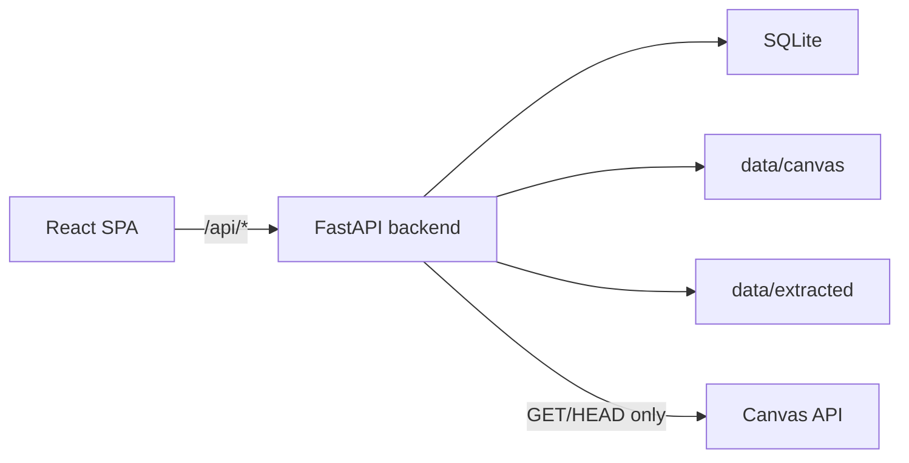

# Canvas Material Manager Technical Documentation

This document describes the current Canvas course material manager implementation.

## Overview

Canvas Material Manager is a local Canvas course material manager. The backend is the only component that talks to Canvas; the browser reads local API responses served by FastAPI. Course metadata, announcements, assignments, calendar events, pages, people, and file indexes are stored in SQLite. Course files can be downloaded into `data/canvas/`, extracted into text under `data/extracted/`, and previewed through local endpoints.

The application currently supports:

- Read-only Canvas synchronization.
- Course, announcement, assignment, people, home page, file, and timeline views.
- Course file indexing, backup, extraction, preview, and ZIP download.
- OCR-assisted extraction for supported document types.
- Runtime settings for Canvas token, sync schedule, OCR, and notifications.
- Sync/file/event logs.

## Stack

| Layer | Technology |
| --- | --- |
| Backend | FastAPI, httpx, pydantic-settings |
| Database | SQLite |
| Extraction | PyMuPDF, python-pptx, python-docx, BeautifulSoup, Pillow, pytesseract |
| Frontend | React 19, TypeScript, Vite |
| Styling | Tailwind CSS and local CSS |
| Icons | lucide-react |
| Tests | pytest, FastAPI TestClient, TypeScript build |

## Source Layout

```text
backend/app/
  main.py                 FastAPI application and lifespan
  config.py               Environment settings
  db.py                   SQLite schema, migrations, settings, sync/event helpers
  canvas_client.py        Read-only Canvas client
  sync_service.py         Canvas metadata and file-index synchronization
  backup_service.py       File download and local version handling
  extraction_service.py   Text extraction and OCR
  notification_service.py Notification delivery helpers
  runtime.py              Shared app state and service factories
  api/
    courses.py            Course metadata and timeline endpoints
    files.py              File backup, extraction, preview, download endpoints
    settings.py           Settings endpoints
    sync.py               Sync status/run/cancel endpoints
    events.py             Event log endpoints
    health.py             Health endpoint

frontend/src/
  App.tsx                 Routes, app state, polling, shell layout
  api/                    REST client wrappers
  components/             Shared UI components
  context/                App context
  hooks/                  View hooks
  i18n/                   English and Chinese labels
  types/                  Frontend response contracts
  utils/                  Formatting, labels, progress, course grouping
  views/                  Dashboard, course detail, settings, tabs

```

Runtime/generated paths such as `data/`, `.venv/`, `frontend/dist/`, and `__pycache__/` are not source modules.

## Runtime Flow



Startup flow:

1. Load `Settings`.
2. Create the data directory.
3. Initialize `AppState`.
4. Initialize SQLite schema and migrations.
5. Mark stale running sync tasks as interrupted.
6. Start the scheduler when sync scheduling is enabled.

`AppState` keeps the settings, database handle, sync locks, file sync lock, cancel event, and scheduler task.

## Database

Main tables:

| Table | Purpose |
| --- | --- |
| `settings` | Runtime settings |
| `courses` | Canvas course metadata |
| `announcements` | Course announcements |
| `assignments` | Course assignments |
| `calendar_events` | Canvas calendar events |
| `pages` | Canvas pages, including home/front page candidates |
| `course_people` | Course members |
| `files` | File index, local backup state, extraction state |
| `sync_runs` | Sync task status and progress |
| `event_logs` | Runtime event log |
| `schema_migrations` | Applied schema migrations |

Migration version 3 is retained for existing database compatibility.

## Backend APIs

All endpoints are under `/api`.

| Method | Path | Purpose |
| --- | --- | --- |
| GET | `/api/health` | Health and latest sync summary |
| GET | `/api/courses` | Course list |
| GET | `/api/courses/{course_id}/detail` | Course detail bundle |
| GET | `/api/courses/{course_id}/announcements` | Course announcements |
| GET | `/api/courses/{course_id}/assignments` | Course assignments |
| GET | `/api/courses/{course_id}/people` | Course members |
| GET | `/api/courses/{course_id}/home` | Selected Canvas home page |
| GET | `/api/courses/{course_id}/timeline` | Structured assignment/calendar/announcement timeline |
| GET | `/api/courses/{course_id}/files` | Course file list |
| POST | `/api/courses/{course_id}/files/sync` | Sync file index, download, and extract course files |
| POST | `/api/courses/{course_id}/files/{file_id}/backup` | Backup one file and extract it |
| POST | `/api/courses/{course_id}/files/{file_id}/extract` | Extract one downloaded file |
| GET | `/api/courses/{course_id}/files/{file_id}/preview` | Preview a local file |
| GET | `/api/courses/{course_id}/files/{file_id}/download` | Download one local file |
| POST | `/api/courses/{course_id}/files/download` | Download selected local files as ZIP |
| POST | `/api/sync/run` | Start global metadata sync |
| POST | `/api/courses/{course_id}/sync` | Start one-course metadata sync |
| POST | `/api/sync/cancel` | Request sync cancellation |
| GET | `/api/sync/status` | Sync status |
| GET | `/api/settings` | Canvas, sync, OCR, notification settings |
| PUT | `/api/settings/canvas` | Save Canvas token |
| POST | `/api/settings/canvas/test` | Test Canvas token |
| GET | `/api/settings/sync` | Read sync schedule |
| PUT | `/api/settings/sync` | Save sync schedule |
| PUT | `/api/settings/notifications` | Save notification settings |
| GET | `/api/events` | Event logs |

## Frontend

The frontend routes are:

- `/` dashboard
- `/course/:courseId` course detail
- `/settings` settings

`App.tsx` owns app-level data loading, sync polling, current course selection, route state, language state, search query, and the global error banner.

Course detail tabs:

- Timeline: built from synced assignments, calendar events, and announcements.
- Data vault: file backup, extraction, preview, and download.
- Broadcasts: announcements.
- Assignments: assignments and submission details.
- People: synced course members.

Settings contains Canvas credentials, OCR status, sync scheduler settings, notification settings, event logs, and read-only boundary information.

## Security Boundaries

- Canvas credentials stay server-side.
- The Canvas client only permits `GET` and `HEAD`.
- Canvas API requests must target the configured host and allowlisted paths.
- Canvas file download redirects are allowed only when safe and do not forward the Canvas authorization header to external hosts.
- Preview and download endpoints resolve files from the database and ensure local paths remain inside `data_dir`.
- Canvas file metadata is redacted before persistence so temporary verifier URLs are not stored.

## Development

Install and run:

```powershell
python -m venv .venv
.\.venv\Scripts\Activate.ps1
pip install -r requirements.txt
npm install
npm --prefix frontend install
Copy-Item .env.example .env
.\start.ps1
```

Manual development command:

```powershell
npm run dev
```

Build frontend:

```powershell
npm --prefix frontend run build
```

Run backend tests:

```powershell
pytest
```

Current verification targets:

- Backend API smoke tests, migration tests, Canvas client tests, backup tests, notification tests, sync tests.
- Frontend TypeScript and Vite production build.
